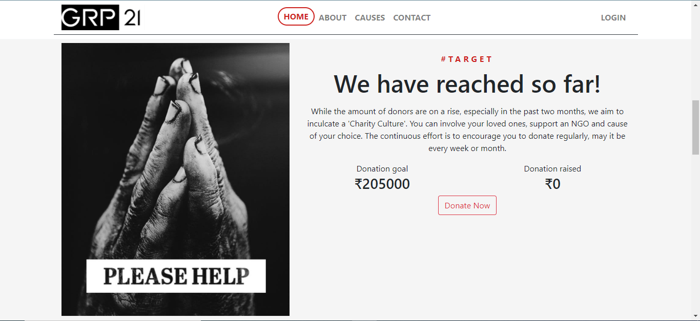

# Donation Platform - Documentation
This application has been designed by GROUP 21, as a semester project for WEB APPLICATION DEVELOPMENT course.

## Contents
<ul> 
    <li><a href="#introduction">Introduction</a></li>
    <li><a href="#installation">Installation</a>
    <ul>
        <li><a href="#sqlite3">With SQLITE3</a></li>
        <li><a href="#postgresql">With PostgreSQL</a></li>
    </ul>
    </li>
    <li><a href="#code">Code Snippets</a></li>
    <li><a href="#screenshots">Screenshots</a></li>
    <li><a href="#contributors">Contributors</a></li>
    <li><a href="#deployed-website">Deployed Website</a></li>
    <li><a href="#tech-stack">Tech Stack</a></li>
   </ul>

## Introduction
This project has three modules namely, Admin, NGO and Donor.
Admin can login as a super-user and manage the requests raised by NGOs. The NGO will be added to the system after verifying the documents sent by the them via the contact page.
Once approved, NGOs can login to the NGO module/app and view the interface. This page displays a table of all their causes and donations, where they can add, edit and delete their causes.
Donors can simply register and login using their google credentials. They can decide to donate to any of the causes added by the NGOs. The digital payment is hassle free, secure and includes many payment options, thanks to the Razorpay API. Donors will get an email confirmation and their user profile will show all their donations with the respective cause name and amount.

## Installation
After [cloning](https://docs.github.com/en/github/creating-cloning-and-archiving-repositories/cloning-a-repository) the repo.
```console
foo@bar:~$ pip install -r requirements.txt
```
### SQLITE3
```console
foo@bar:~$ python manage.py runserver
```
### PostgreSQL
Setup your [postgresql account](https://pynative.com/python-postgresql-tutorial/#:~:text=Install%20Psycopg2%20using%20the%20pip%20command&text=This%20module%20is%20available%20on,pip%20command%20to%20install%20Psycopg2.&text=You%20can%20also%20install%20a%20specific%20version%20using%20the%20following%20command.).

Add your details to charity > settings.py :
```
DATABASES = {
    'default': {
        'ENGINE': 'django.db.backends.postgresql',
        'NAME': 'donationplatform',
        'USER': '<username>',
        'PASSWORD': '<password>',
        'HOST': 'localhost'
    }
}
```
```console
foo@bar:~$ python manage.py collectstatic
foo@bar:~$ python manage.py makemigrations
foo@bar:~$ python manage.py migrate
foo@bar:~$ python manage.py runserver
```
You're all set to go.

Note: sqlite3 file contains a pre-filled database, whereas, if you setup postgres, the superuser, ngos and causes must be added.


## Code

```
def get_user(request):
    # Sends logged in user's data
    if request.user.is_authenticated:
        donation = Donations.objects.filter(paid=False)
        donation.delete()
        if not Users.objects.filter(email=request.user.email).exists():
            u = Users(email=request.user.email)
            u.save()
        u = Users.objects.get(email=request.user.email)
        print(u.pk)
        donations = Donations.objects.filter(user_id=u)
        u_dict = {'email': u.email, 'amt': u.total_amt,
                  'since': u.since, 'id': u.pk, 'donations': donations}
    return u_dict
 ```
 The above function helps fetch the details of an authenticated user and it is called for every page. At each run, it deletes unpaid/failed donations from the database aswell.
 
 ```
     if request.method == "POST" and request.user.is_authenticated:
        # because razorpay handles in paisa
        amount = int(request.POST.get("amount"))*100
        cause = request.POST.get("cause")
        ngo = request.POST.get("ngo")
        client = razorpay.Client(
            auth=("rzp_test_GsYLne4Fqnrf4m", "5FbYXB3Lhc3MO9e9d9GNgEmY"))
        payment = client.order.create(
            {'amount': amount, 'currency': 'INR', 'payment_capture': '1'})
        print(payment)
        u_dict = get_user(request)
        user_id = Users.objects.get(pk=u_dict['id'])
        cause_id = Causes.objects.get(cause=cause, ngo_name=ngo)
        donation = Donations(cause_name=cause, cause_id=cause_id, user_id=user_id,
                             amount=amount/100, razorpay_id=payment['id'])
        donation.save()
        u_dict['payment'] = payment
        u_dict['cause'] = cause
        u_dict['ngo'] = ngo
        return render(request, "donate.html", u_dict)
```
Once a donation form is submitted, this code helps with the payment using Razorpay and then it is added to the database.

```
#function to send confirmation mail to donor
 msg_plain = render_to_string('email.txt')
 msg_html = render_to_string('email.html', {"cause": cause.cause, "amt": donation.amount, "order": order_id})
        send_mail("Your donation has been received.", msg_plain, settings.EMAIL_HOST_USER,
                  [user.email, ], html_message=msg_html, fail_silently=False, )
```                 
Email.html is rendered and sent as an email using the application parameters below.
```
# Application definition in settings.py

EMAIL_USE_TLS = True
EMAIL_HOST = 'smtp.gmail.com'
EMAIL_HOST_USER = 'dude05422@gmail.com'
EMAIL_HOST_PASSWORD = 'ujhbteodtzbfiycx'
EMAIL_PORT = 587
EMAIL_BACKEND = 'django.core.mail.backends.smtp.EmailBackend'

```

```
    if request.method == 'POST':
        form = ContactForm(request.POST)
        if form.is_valid():
            subject = "Mail received"
            name = request.POST.get('first_name') + \
                " " + request.POST.get('second_name')
            email = request.POST.get('email_address')
            message = request.POST.get('message')
            message = "Name: "+name + "\nMessage: " + message
            print(message)
            send_mail(subject, message, email, [
                'dude05422@gmail.com', ], fail_silently=False,)
            return redirect("/")

```
The above code segment is used to send a confirmation mail to a NGO, when it contacts the admin for NGO registraion and for any other queries sent by users.
```
class ContactForm(forms.Form):
    first_name = forms.CharField(max_length=50, required=True, widget=forms.TextInput(
        attrs={'class': 'form-control', 'placeholder': 'First Name'}))
    second_name = forms.CharField(max_length=50, required=True, widget=forms.TextInput(
        attrs={'class': 'form-control', 'placeholder': 'Second Name'}))
    email_address = forms.EmailField(max_length=150, required=True, widget=forms.EmailInput(
        attrs={'class': 'form-control', 'placeholder': 'Email'}))
    message = forms.CharField(widget=forms.Textarea(
        attrs={'class': 'form-control', 'placeholder': 'Message', 'style': "width: 100%; height: 150px;"}),
        max_length=2000, required=True)
```
Forms.py is used to generate a contact form, making it easier to generate and send as an email.

```

# NGO homes page, handles login, display causes for respective logged in NGO
    if request.user.is_authenticated:
        if request.user.first_name == "NGO":
            causes = Causes.objects.filter(ngo_name=request.user.username)
            return render(request, "ngo.html", {"causes": causes})
        else:
            return redirect("index")
```
The above code segment is for the NGO module, when any NGO logs in they can view a list of their causes dynamically.

```
    if c == "add":
        if Causes.objects.filter(cause=cause, ngo_name=request.user.username).exists():
            messages.error(request, "Cause already exists")
            return render(request, "edit-cause.html", {"cause": "add"})
        else:
            new_cause = Causes(
            cause=cause, ngo_name=request.user.username, amount_req=amt_req, image=image)
            new_cause.save()
    else:
        # Editing existing cause
        new_cause = Causes.objects.get(
        cause=cause, ngo_name=request.user.username)
        # Deleting existing cause
        if "delete" in request.POST:
            new_cause.delete()
        else:
            new_cause.cause = cause
            new_cause.amount_req = amt_req
            if image != None:
                new_cause.image = image
                new_cause.save()
    return redirect("ngo")
```
This is the add/edit form for the NGO. After it is submitted, either a new cause is added, updated or deleted. This is checked by the if statements and it's validation is done by cross-checking it with the Causes database.

The below section is for **Database** .
```

# Database modal for registered users
class Users(models.Model):
    email = models.EmailField()
    total_amt = models.PositiveIntegerField(default=0)
    since = models.DateTimeField(auto_now_add=True)

# Database model for all Causes added and edited by NGOs
class Causes(models.Model):
    cause = models.CharField(max_length=50)
    ngo_name = models.CharField(max_length=50)
    amount_req = models.PositiveIntegerField()
    amount_donated = models.PositiveIntegerField(default=0)
    image = models.URLField(default="static/images/index/img-4.jpg")

# Database model for all Donations which contains razorpay payment id
class Donations(models.Model):
    cause_name = models.CharField(max_length=50)
    cause_id = models.ForeignKey(Causes, on_delete=models.SET_NULL, null=True)
    user_id = models.ForeignKey(Users, on_delete=models.DO_NOTHING)
    amount = models.PositiveIntegerField()
    razorpay_id = models.CharField(unique=True, max_length=50)
    paid = models.BooleanField(default=False)

```

The above code section is database description in model.py. As we have earlier mentioned, our projects consists of three modules- Admin, NGO and Donor . Here are the databases for them respectively.


## Screenshots
<br>
<p float="left">


</p>
<p float="left">


</p>
<p float="left">


</p>

<p float="left">


</p>
<p float="left">


</p>
<br>


## Contributors
[Piyush Kumar](https://github.com/piyush9311)<br>
[S Suryavardan](https://github.com/surya1701)<br>
[Anurag Kumar](https://github.com/anu725053)<br>
[Himesh Kumar](https://github.com/Himesh18)<br>
[Chaintany Anand Kopoori](https://github.com/chaitanya9993)<br>

## Deployed Website
[Deployed Website](https://donationplatform-wad.herokuapp.com/)
The project has been deployed on Heroku, with sqlite3.
Due to the weight of the app and heroku, when using it for the first time, the website may take some extra time to load.

## Tech Stack


**WAD | Group 21**
